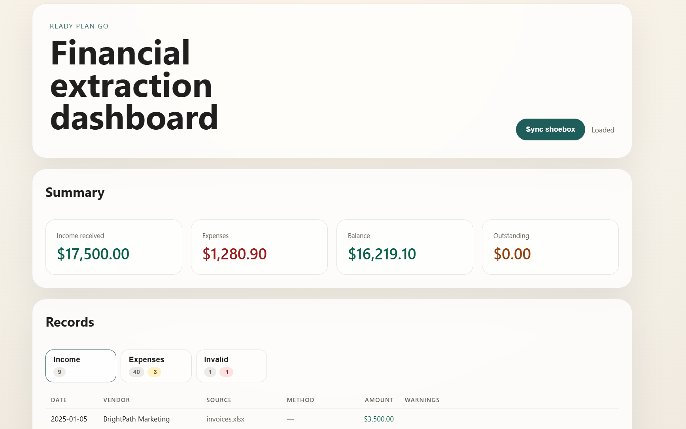

# Financial Files Extractor
This tool was developed for the Ready Plan Go - Spring 2026 Dev Challenge.

## Goal

The goal of this tool is to parse, clean, and transform messy, unorganized financial data from a freelancer's "shoebox" and present it in a clear, actionable dashboard overview.

### Features

The generated dashboard provides:

- Total revenue from invoices
- Total expenses from statements and receipts
- Net profit estimate
- Suspicious or incomplete records
- Source traceability back to the original document

### Results

The extraction pipeline successfully recovered the vendor, date, and amount for every valid financial transaction present in the provided dataset.

In addition, the system:

- Correctly identified the image in the receipts folder that was not a receipt.
- Detected the handwritten reimbursement note and classified it separately from standard cash receipts.
- Flagged outstanding invoices that had not yet been paid.
- Flagged reimbursable expenses while allowing users to optionally include or exclude them from dashboard totals.


### Preview



## File Layout

The repository implements a highly modular data extraction and presentation pipeline:

- `extractors/parse_excel.py` for spreadsheet containing list of invoices.
- `extractors/parse_pdf.py` for text-based PDF bank statements.
- `extractors/parse_images.py` for receipt images and OCR fallback wiring.
- `main.py` as the orchestrator that scans `shoebox/`, and writes `app_data.json`.
- `server.py` as a Flask API backend with `GET /api/dashboard` and `POST /api/sync`.
- `frontend/` as a minimal dashboard shell that consumes the API.
- `tests/` as a small unittest suite for the data pipeline and API routes.


### Run order

1. Install Python dependencies from `requirements.txt`.
2. GPU Acceleration Setup: Install the appropriate version of PyTorch matching your hardware's CUDA version (see pytorch.org). For optimal VLM inference speeds, a GPU with at least 8 GB of VRAM is recommended.
3. Run `python server.py` to serve the API and frontend shell.

The repository already includes a pre-generated `app_data.json`
representing the extracted challenge data. This allows the dashboard
to be explored immediately without rerunning the extraction pipeline.

A new extraction can be triggered at any time through the dashboard's
"Sync" button.

### Test command

Run the full unit test suite with:

```bash
python -m unittest discover -s tests
```


## Architecture

This architecture was conceived to be completely modular and highly extendable. By implementing a separate extractor for each distinct data source (Excel, PDF, and Images), adding support for future file types is seamless. To ensure reusability, the extractors are context-free—adapting them to slightly different document formats can be done simply by updating a prompt, a regex string, or a column-mapping dictionary.  

### 1. Excel Extractor (parse_excel.py)
Built using the pandas library to efficiently ingest tabular data. To maximize robustness against unpredictable freelancer formatting, a dictionary of common column synonyms (e.g., "Date Paid", "Billing Date") is implemented to normalize fields automatically.  

### 2. PDF Extractor (parse_pdf.py)
Utilizes pdfplumber to extract raw text lines from credit card statements. Because the unstructured layout of the source document prevented clean tabular extraction out of the box, targeted regular expressions (Regex) are used to isolate transaction lines and safely filter out headers and irrelevant content.  

### 3. Image Extractor (parse_images.py)
Reading unstructured text from messy, varied photos of receipts is a historically difficult problem for traditional OCR libraries like PyTesseract. Vision-Language Models have recently shown strong performance on complex document understanding tasks and are often more robust than traditional OCR pipelines when document layouts are highly variable.  Adhering strictly to the open-source and no-paid-API constraints, I selected Qwen2-VL-2B-Instruct. Instead of enforcing restrictive logit-masking tokens during generation like I had originally planned (which can degrade a 2B model's attention mechanisms on specific elements), the pipeline uses unconstrained generation which is still able to output correct JSON with the right prompting. This allows the model to output natural text blocks that are subsequently cleaned via regex and mapped into a standardized schema. In practice, providing an explicit JSON template in the prompt resulted in consistently valid structured outputs across the challenge dataset.

### 4. Data Standardization & Frontend
All extractors map their data into a single unified JSON schema. This file acts as a caching layer, avoiding the need to rerun expensive visual model inferences unless a fresh sync is requested. The Flask backend serves this data to a minimal web dashboard that displays individual records, aggregates financial totals, flags problematic anomalies, and allows the user to trigger an extraction re-sync.  

## Future

### What Was Scoped Out For 48 Hours   

* notes.txt Parsing: Processing unstructured natural language notes was deprioritized in favor of building the core structural pipelines for invoices, statements, and receipts. 
* Advanced Frontend Features: Even though a good UI is essential since it's what the client interacts with, work on UI/UX was deferred to prioritize engineering a reliable multi-modal data extraction engine.  
* Database : For a single-user challenge completed in 48 hours, a JSON cache provided the simplest persistence layer while keeping the architecture easy to understand and deploy. A production version would migrate to SQL once multi-user support becomes necessary.

### If Given Another Month & Access to Paid APIs
* Upgraded Foundation Models: Migrate the image pipeline to bigger models like GPT-4o or Claude 3.5 Sonnet. This would provide near-perfect visual text recognition and line-item resolution. It would also give me the confidence to try to apply the image extraction pipeline to PDF documents. I did not do that in the current architecture since I deemed it too unreliable since there is a high chance of confusion between all the transactions on the same page.
* Contextual Cross-Referencing via LLMs: Parse notes.txt using a LLM to automatically flag personal expenses, cross-reference cash purchases, and corroborate strange statement entries against written descriptions.  
* Production Cloud Architecture: Replace the local JSON storage file with a SQL database hosted on a cloud platform, adding user authentication.  
* Interactive UI Corrections: Upgrade the frontend dashboard into a fully editable spreadsheet view, allowing freelancers to manually click, correct, override, or re-categorize fields directly inside the web interface if an extraction is uncertain.  
* UI QOL: Add formal, toggleable translations for French and English receipt formatting to native language features and improve presentation with better sorting and filtering of transactions.